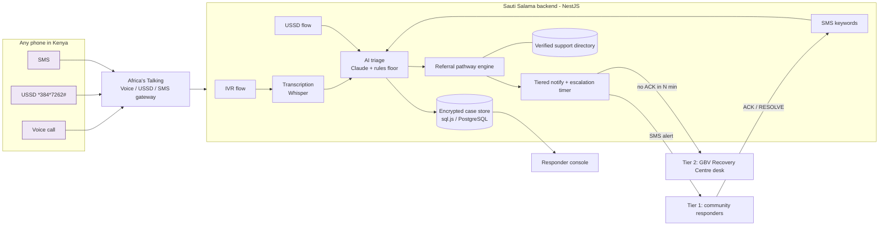

# Sauti Salama - "Safe Voice"

**An offline-first, AI-assisted gender-based violence (GBV) reporting and referral line for Kenya.**
Any phone. No internet. No app. A survivor can call, dial a USSD code or send one SMS and, within seconds, a vetted community responder is alerted, the survivor gets the right next step (the 72-hour medical window, a Protection Order, Childline 116), and nothing about them is stored unencrypted.

Built by [Benard Kimani](https://benardkimani.co.ke) as a solo entry to the **OSF x Andela Hackathon 2026** - track *Safety, Reporting & Protection* (cross-track with *Stability & Social Cohesion*).

> This is an invention-sprint proof of concept, not a live service. If you are in danger in Kenya call **999 / 112**. The national GBV helpline is **1195** (free, 24/7). Childline is **116**.

---

## The problem, in numbers

* Over 40% of Kenyan women aged 15-49 who have ever had a partner have experienced physical or sexual intimate-partner violence; 34% of all women have experienced physical violence since age 15 and 13-14% sexual violence (KDHS 2022, KNBS).
* Most never seek formal help. The barriers are practical: the abuser controls the phone, the household and the money; reporting requires airtime, data or a trip to a station; the survivor does not know that post-rape care is free and only works within 72 hours; and the first official contact is often not survivor-centred.
* Roughly one in three mobile devices in Kenya is still a feature phone (Communications Authority of Kenya sector statistics - confirm the latest quarter before quoting); every existing GBV app assumes a smartphone and a data bundle.

## The solution

Sauti Salama is a **backend**, not an app. It sits behind three channels every phone in Kenya already has:

| Channel | For whom | What happens |
|---|---|---|
| **Call line (IVR)** | anyone who can speak: low literacy, visually impaired, panicked | Language menu -> record what happened -> reference number spoken back -> consent question ("is it safe to call this phone?"). Press **9** at any time for a silent alert. |
| **USSD** `*384*7262#` | anyone who cannot speak: abuser in the next room, deaf survivors | Silent, no data, no trace in the call log or inbox. Structured report in 5 key presses, or **"I am in danger NOW"** in 2. Also: verified help information, call-back request, case status, delete-my-report. |
| **SMS** | anyone who can only text | Free text in English, Kiswahili or Sheng -> AI triage -> responder alerted -> one neutral reply. `HELP`/`MSAADA` returns vetted information; `STOP` erases. |

Behind the channels:

1. **AI triage** (Claude API): the transcript or SMS becomes a structured, bilingual responder brief - violence type, urgency, immediate danger, hours since the incident, perpetrator relationship, child survivor, risk flags (weapon, strangulation, children present), needs. A **rules-based floor** runs first and always: the AI can raise urgency, never lower a danger signal, and the line keeps working with no AI key at all.
2. **Referral pathway engine**: deterministic rules produce ordered next steps with deadlines and the verified service for each (72h PEP / 120h emergency contraception and the PRC form MOH 363; P3 form and Gender Desks; Protection Orders under PADVA 2015; FIDA Kenya legal aid; Childline 116 and mandatory child-protection referral; shelter via 1195/GVRC).
3. **Tiered, community-first routing**: Tier 1 = vetted community responders for the survivor's ward (community health promoters, peace-committee members, trained volunteers). If nobody acknowledges within N minutes, Tier 2 = institutional desk. Police involvement is the survivor's choice, never the default.
4. **Survivor-controlled privacy**: no registration, no ID. Phone numbers and narratives are AES-256-GCM encrypted; the console shows masked numbers; a responder can reveal a number only if the survivor said the phone is safe, and every reveal is logged. The survivor can check status or **erase everything** from the same USSD menu.
5. **Two-way "pull"**: the same USSD/IVR menus return verified information (what is free, what the deadlines are, who to call) - trusted civic information people can act on, which is the hackathon's core theme.

## Quick start (2 minutes, no accounts needed)

```bash
git clone <this repo> && cd sauti-salama
npm install
cp .env.example .env          # optional; defaults work
npm run build && npm start    # or: npm run dev
```

Open:

* **Channel simulator** - http://localhost:3000/simulator.html - a feature-phone USSD emulator, a call-line screen with keypad and recorded-report entry, an SMS chat, and the outbox that shows exactly what responders and survivors receive. It posts the same payloads Africa's Talking sends, so the demo does not depend on any third party.
* **Responder console** - http://localhost:3000/dashboard.html?token=demo-token - cases by urgency, AI brief in English and Kiswahili, next-step checklist, consent flags, audit timeline, accept / resolve / reveal / erase.

`npm run demo` runs the golden path from the terminal; `npm test` runs the triage and pathway unit tests.

### Turning on the real integrations

| What | Env | Notes |
|---|---|---|
| Claude AI triage | `ANTHROPIC_API_KEY`, `ANTHROPIC_MODEL` | Without a key the rules-based triage runs alone (the console's System status menu shows "AI triage: Rules engine"). Model IDs: https://platform.claude.com/docs/en/about-claude/models/overview |
| Voice transcription | `OPENAI_API_KEY` (Whisper) | Without it the simulator's typed transcript / a sample is used. |
| Africa's Talking | `AT_USERNAME`, `AT_API_KEY`, `AT_SENDER_ID`, `PUBLIC_BASE_URL`, `WEBHOOK_SECRET` | See [Connecting Africa's Talking](#connecting-africas-talking) below. |
| Your phone as the responder | `DEMO_RESPONDER_PHONE` | Every Tier-1 alert goes here. |
| Production database | `DB_TYPE=postgres`, `DATABASE_URL` | `docker compose up` starts Postgres + the app. Default is a zero-setup `sql.js` file DB. |
| Encryption | `ENCRYPTION_KEY` (`npm run keygen`), `HASH_PEPPER` | A dev key is used (with a warning) if unset. |

## Connecting Africa's Talking

SMS and USSD work in the free **sandbox**. Voice is not available in the sandbox: it needs a live account, a voice number from Africa's Talking and airtime credit.

1. **Secure the server before it goes public.** In `.env` set a long `DASHBOARD_TOKEN` and a `WEBHOOK_SECRET` (`npm run keygen` prints one). Callbacks without `?key=<WEBHOOK_SECRET>` are refused.
2. **Open a public HTTPS URL.** `npm run tunnel` (needs `brew install cloudflared`, no account) prints an `https://....trycloudflare.com` address. Put it in `PUBLIC_BASE_URL`. A quick tunnel gets a new address every time it starts, so update `.env` and the dashboard when it changes; use a named tunnel or a deployment for anything longer-lived.
3. **Get an API key.** Sign in at [account.africastalking.com](https://account.africastalking.com), open the **sandbox** app, go to *Settings > API Key*, generate a key and paste it into `AT_API_KEY` (keep `AT_USERNAME=sandbox`). Restart the server.
4. **Check everything:** `npm run at:check`. It verifies the key, the tunnel and the webhook protection, and prints the exact callback URLs (with the key) to use next.
5. **Configure the sandbox app** with those URLs:
   * *USSD > Create channel*: pick a code such as `*384*XXXX#`, callback = the USSD URL.
   * *SMS > Shortcodes > Create*: pick a shortcode, then *SMS > SMS Callback URLs*: *Incoming messages* = the SMS incoming URL, *Delivery reports* = the delivery URL. Set `AT_SENDER_ID` to the shortcode so replies thread with the survivor's messages.
6. **Test with the Africa's Talking simulator** ([simulator.africastalking.com](https://simulator.africastalking.com)): enter a phone number, dial your USSD code or text your shortcode. Cases appear in the console. In the sandbox, SMS is only delivered to numbers open in the simulator, so set `DEMO_RESPONDER_PHONE` to a second simulator number to watch responder alerts arrive.

**Going live** means a production app username and key, a dedicated or shared USSD code and an SMS shortcode or sender ID approved through Africa's Talking (telco approval takes time and has setup costs), a voice number for the call line, a permanent HTTPS deployment instead of a quick tunnel, and a real `ENCRYPTION_KEY` and `HASH_PEPPER` set on a fresh database.

## How it works



Full diagrams, sequence flows and the data model: [docs/ARCHITECTURE.md](docs/ARCHITECTURE.md).

## Repository map

```
src/
  channels/voice   IVR: Africa's Talking call-action XML, language menu, record, silent alert, consent
  channels/ussd    USSD state machine (report / danger now / info / call back / status / delete)
  channels/sms     inbound keywords (ACK, RESOLVE, HELP, YES, STOP) + free-text reports
  ai/              Claude prompt + JSON contract, rules-based floor, transcription, place gazetteer
  cases/           case service, referral pathway engine, tiered notify + escalation, audit events, retention purge
  resources/       verified support directory (seeded)
  responders/      vetted responder registry (seeded with demo data)
  i18n/            every survivor-facing string, English + Kiswahili
  common/          AES-256-GCM crypto, phone masking, reference codes, SMS outbox
public/            simulator.html, dashboard.html
docs/              architecture, written summary, pitch deck, demo script, compliance, sprint plan, AI usage
test/              unit tests (triage rules, pathway engine)
```

## Design decisions worth knowing

* **AI structures, humans decide, survivors get vetted text.** The model only ever produces the responder brief. Every word a survivor sees or hears is a reviewed template (`src/i18n/messages.ts`). No hallucinated advice can reach a survivor.
* **Silence is a feature.** USSD leaves no trace; the voice line's "9" hangs up immediately so the call log shows a misdial; the SMS channel sends exactly one neutral reply until the survivor says the phone is safe.
* **No registration.** Anonymity is the difference between a report and no report. Abuse of the line is handled by rate limiting, responder vetting and the acknowledgement loop, not by ID checks.
* **No blockchain, on purpose.** GBV disclosures are sensitive personal data under the Kenya Data Protection Act 2019; the right to erasure and storage limitation are incompatible with an immutable ledger. Erasure here is a real hard delete you can trigger from a KSh 0 USSD session.
* **Degrades gracefully.** No AI key -> rules triage. No transcription key -> sample transcript. No Africa's Talking key -> console outbox. No Postgres -> file database. The demo cannot be broken by a third party being down.

## Roadmap after the sprint

1. Pilot with two community responder networks in Nairobi (e.g. Kayole and Kibra) and one GBV Recovery Centre as Tier 2; measure time-to-acknowledge.
2. Pre-recorded Kiswahili voice prompts (drop-in via `SW_AUDIO_BASE_URL`), then Dholuo, Gikuyu, Somali, Kalenjin.
3. Responder accounts and roles, rate limiting per number, telco zero-rating of the USSD code, WhatsApp channel.
4. Location without GPS: ward-level lookup from the survivor's typed area, later telco cell-site LBS under a data-sharing agreement.
5. Anonymised, aggregated incident reporting for county GBV working groups (ward-level heat maps, never case-level).

## AI tools in this project

The core idea - an offline-first, feature-phone-first GBV line with community-first routing and survivor-controlled privacy - is the author's. Claude (Anthropic) was used as a coding assistant to scaffold the NestJS modules, write tests and draft documentation from the author's design; Claude's API is used inside the product for triage. Details: [docs/AI_USAGE.md](docs/AI_USAGE.md).

## Licence

MIT. Support-directory numbers marked `verified: false` in `src/resources/seed.ts` must be confirmed before any real use.
