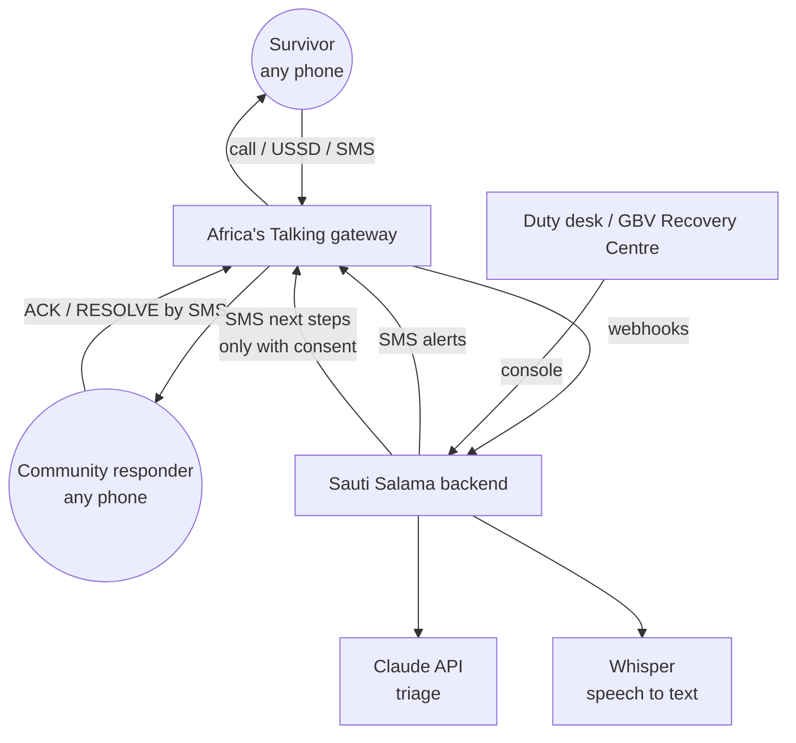
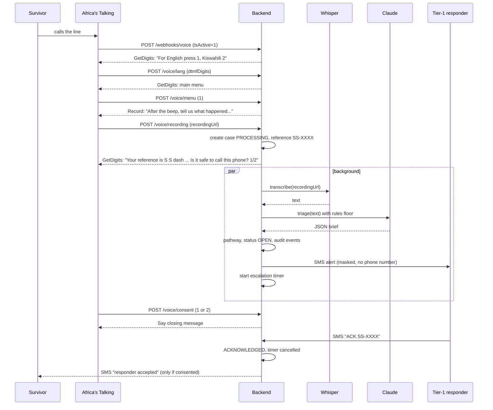
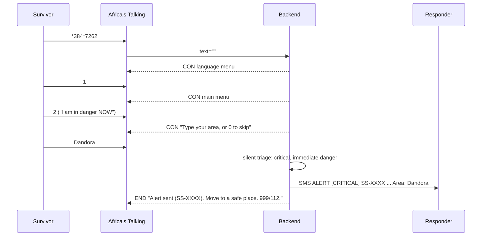
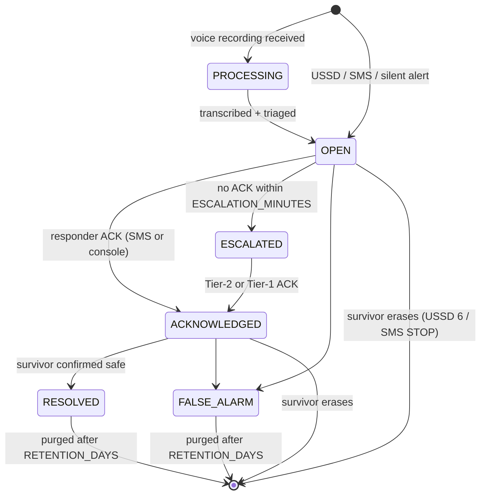
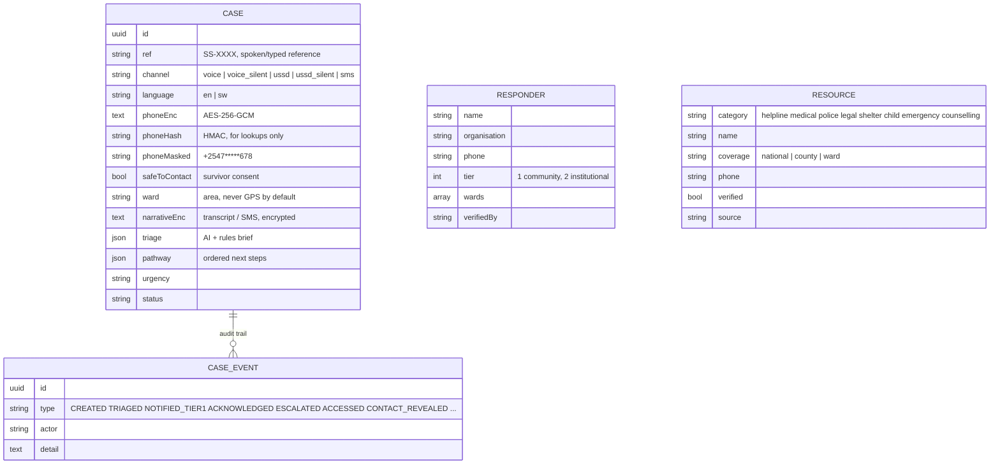

# Architecture

## 1. Context



Everything survivor-facing is delivered by the telco network (voice, USSD, SMS). The backend never needs the survivor to have data, an app or an account.

## 2. Components

| Component | Responsibility | Code |
|---|---|---|
| Voice IVR | Language menu, main menu, record report, urgent info, counsellor transfer / call-back, silent alert (9), consent | `src/channels/voice` |
| USSD | `*384*7262#` state machine: report, danger now, info, call back, status, delete | `src/channels/ussd` |
| SMS | Inbound keywords for survivors (HELP, YES, STOP) and responders (ACK, RESOLVE); free-text reports | `src/channels/sms` |
| Transcription | Recording URL -> text (Whisper), mock in the simulator | `src/ai/transcription.service.ts` |
| Triage | Rules floor + Claude JSON brief, validated and merged | `src/ai/rules.ts`, `src/ai/triage.service.ts`, `src/ai/prompts.ts` |
| Referral engine | Triage -> ordered bilingual next steps + verified service per step | `src/cases/referral.service.ts` |
| Notify | Tier-1 SMS to ward responders, escalation timer to Tier 2, survivor SMS only with consent | `src/cases/notify.service.ts` |
| Case store | Encrypted case, audit events, retention purge, erasure | `src/cases/*`, `src/entities/*` |
| Directory | Verified support services, seeded | `src/resources` |
| Console | Responder view, audited actions | `public/dashboard.html`, `src/api` |
| Simulator | Reproduces Africa's Talking payloads locally | `public/simulator.html` |

## 3. Sequences

### 3.1 Voice: recorded report



### 3.2 USSD: "I am in danger NOW"



Three key presses and a word. No data, no airtime on most networks, nothing left on the phone.

### 3.3 SMS: free-text report

```mermaid
sequenceDiagram
  participant S as Survivor
  participant B as Backend
  participant R as Responder
  S->>B: "Naomba msaada, jana usiku nilibakwa na jirani hapa Kibra..."
  B->>B: rules floor (sexual, 30h, Kibra, acquaintance) + Claude brief
  B->>R: ALERT [HIGH] ... Next: health facility within 72h (PEP)
  B-->>S: one neutral reply with reference; "Reply YES if it is safe to text this number"
  S->>B: YES
  B-->>S: next steps in Kiswahili (72h PEP, PRC form, 1195)
```

## 4. Case lifecycle



## 5. Data model



## 6. The triage contract

Input to the model: channel, interface language, menu facts, and the report inside `<report>` tags marked as untrusted data. Output: one JSON object (see `src/ai/prompts.ts`). Post-processing (`normalizeTriage`):

* unknown enum values are dropped, strings clamped, arrays de-duplicated;
* the rules floor is merged in: `immediate_danger = ai || rules`, `urgency = max(ai, rules)`, risk flags are unioned;
* if the model is slow (>12 s), errors, or is not configured, the rules result is used unchanged.

This makes the AI a strict improvement and never a single point of failure.

## 7. Deployment

* PoC: `npm start` anywhere with Node 18+, file database, `ngrok` for Africa's Talking callbacks.
* Production shape: Docker image (multi-stage, `Dockerfile`), PostgreSQL (`docker-compose.yml`), behind Nginx/Traefik with TLS on a Contabo VPS; webhook endpoints restricted to Africa's Talking IPs; encryption key and pepper from a secrets store; daily encrypted backups with the same retention window.
