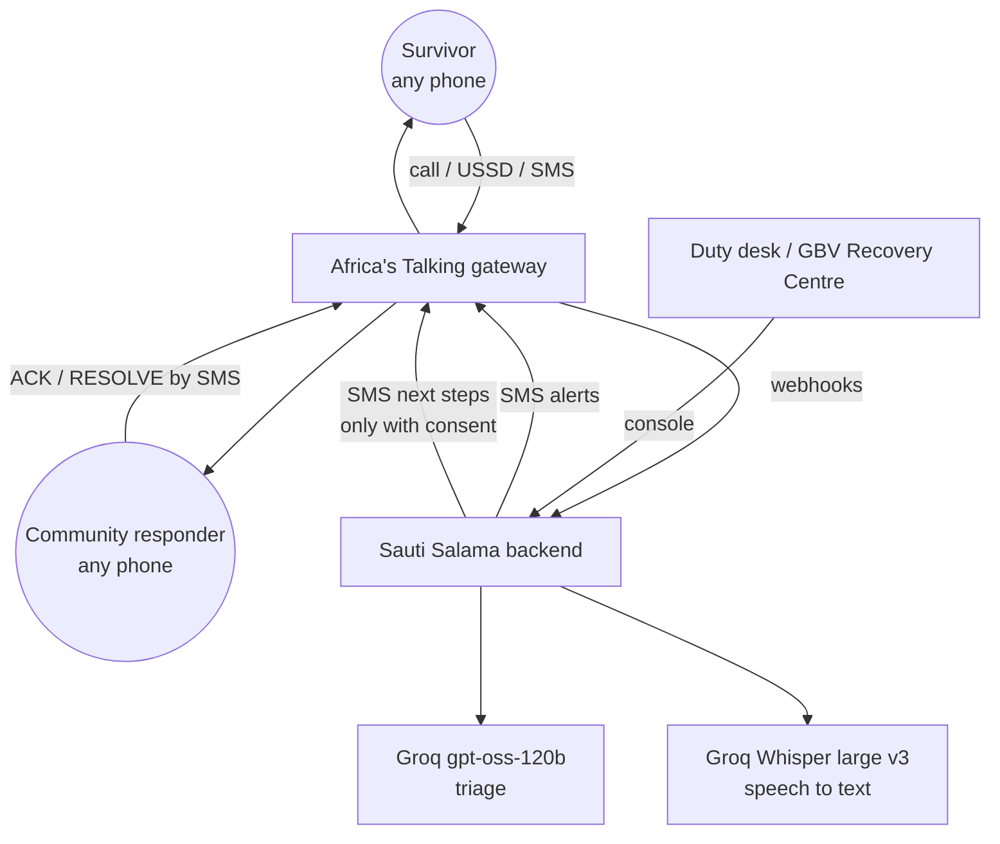
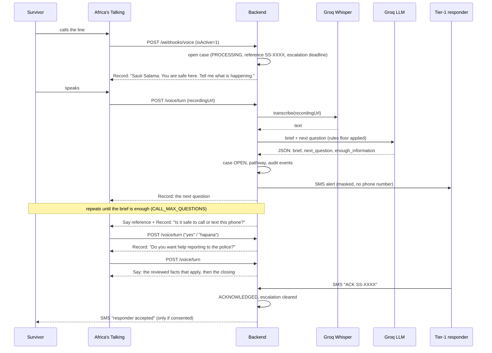
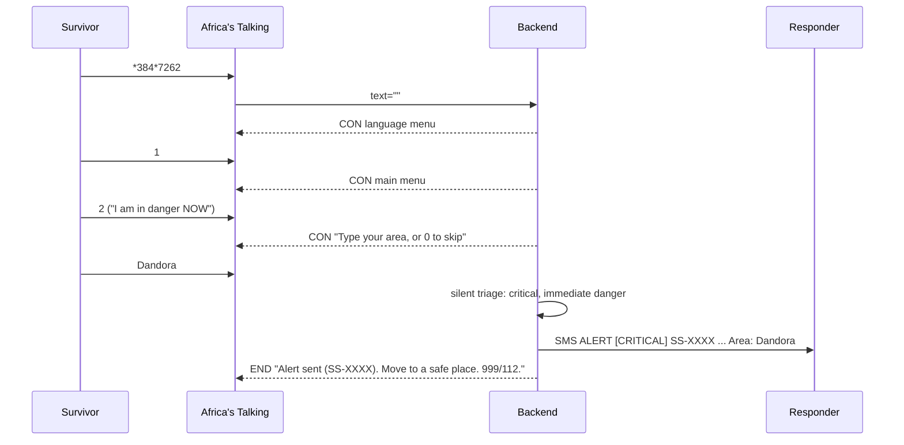
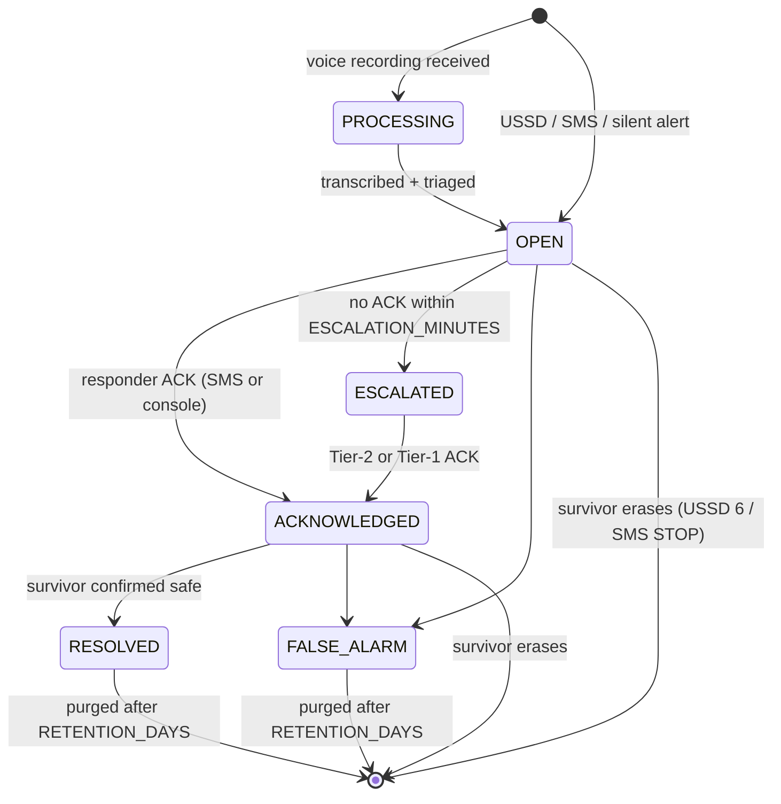
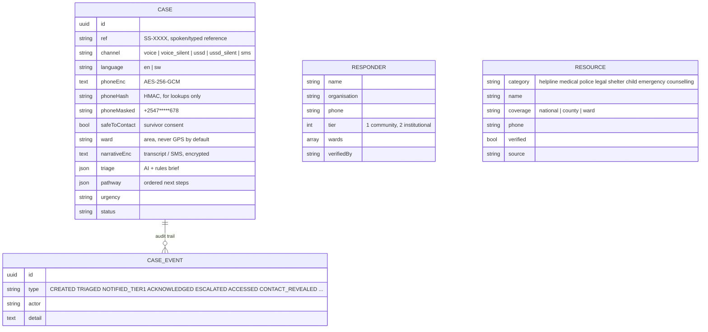

# Architecture

## 1. Context

```mermaid
flowchart TB
  S((Survivor<br/>any phone)) -->|call / USSD / SMS| GW[Africa's Talking gateway]
  R((Community responder<br/>any phone)) -->|ACK / RESOLVE by SMS| GW
  GW -->|webhooks| B[Sauti Salama backend]
  B -->|SMS alerts| GW --> R
  B -->|SMS next steps<br/>only with consent| GW --> S
  B --> AI[Groq gpt-oss-120b<br/>triage]
  B --> STT[Groq Whisper large v3<br/>speech to text]
  D[Duty desk / GBV Recovery Centre] -->|console| B
```

Everything survivor-facing is delivered by the telco network (voice, USSD, SMS). The backend never needs the survivor to have data, an app or an account.

## 2. Components

| Component | Responsibility | Code |
|---|---|---|
| Call line | No menu: greet, listen, one question at a time, contact and police consent in the caller's own words, closing. Counsellors ring first when configured | `src/channels/voice` |
| Call brain | Per turn: refresh the brief, decide the next question or stop. Channel-independent, so a real-time agent can drive it | `src/ai/conversation.service.ts`, `src/ai/conversation.ts` |
| USSD | `*384*7262#` state machine: report, danger now, info, call back, status, delete | `src/channels/ussd` |
| SMS | Inbound keywords for survivors (HELP, YES, POLICE, STOP; same phone only) and registered responders (ACK, RESOLVE); free-text reports | `src/channels/sms` |
| Transcription | Recording URL (allow-listed hosts only) -> text (Whisper large v3 on Groq), simulator text in development; a failure makes an urgent untranscribed case | `src/ai/transcription.service.ts` |
| Triage | Rules floor + Groq JSON-schema brief (Claude optional), validated and merged, overrides recorded in `safety_floor` | `src/ai/rules.ts`, `src/ai/triage.service.ts`, `src/ai/prompts.ts` |
| Referral engine | Triage -> ordered bilingual next steps + verified service per step | `src/cases/referral.service.ts` |
| Notify | Tier-1 SMS to ward responders (in parallel, per-recipient outcome audited), escalation deadline stored on the case and acted on by a sweeper (retried if Tier 2 cannot be reached), survivor SMS only with consent | `src/cases/notify.service.ts` |
| Case store | Encrypted case, audit events, retention purge, erasure | `src/cases/*`, `src/entities/*` |
| Directory | Verified support services, seeded | `src/resources` |
| Console | Responder view, audited actions; `/api/health` (public, database ping) and `/api/status` (token) | `public/dashboard.html`, `src/api` |
| Simulator | Reproduces Africa's Talking payloads locally | `public/simulator.html` |

## 3. Sequences

### 3.1 Voice: a call taken by the AI

```mermaid
sequenceDiagram
  participant S as Survivor
  participant AT as Africa's Talking
  participant B as Backend
  participant W as Groq Whisper
  participant C as Groq LLM
  participant R as Tier-1 responder
  S->>AT: calls the line
  AT->>B: POST /webhooks/voice (isActive=1)
  B->>B: open case (PROCESSING, reference SS-XXXX, escalation deadline)
  B-->>AT: Record: "Sauti Salama. You are safe here. Tell me what is happening."
  S->>AT: speaks
  AT->>B: POST /voice/turn (recordingUrl)
  B->>W: transcribe(recordingUrl)
  W-->>B: text
  B->>C: brief + next question (rules floor applied)
  C-->>B: JSON: brief, next_question, enough_information
  B->>B: case OPEN, pathway, audit events
  B->>R: SMS alert (masked, no phone number)
  B-->>AT: Record: the next question
  Note over S,B: repeats until the brief is enough (CALL_MAX_QUESTIONS)
  B-->>AT: Say reference + Record: "Is it safe to call or text this phone?"
  AT->>B: POST /voice/turn ("yes" / "hapana")
  B-->>AT: Record: "Do you want help reporting to the police?"
  AT->>B: POST /voice/turn
  B-->>AT: Say: the reviewed facts that apply, then the closing
  R->>B: SMS "ACK SS-XXXX"
  B->>B: ACKNOWLEDGED, escalation cleared
  B-->>S: SMS "responder accepted" (only if consented)
```

A caller who says nothing twice becomes a silent, critical alert. A caller who hangs up at any point still leaves the
case opened at the first line, which escalates on its own if nobody accepts it.

### 3.2 USSD: "I am in danger NOW"

```mermaid
sequenceDiagram
  participant S as Survivor
  participant AT as Africa's Talking
  participant B as Backend
  participant R as Responder
  S->>AT: *384*7262#
  AT->>B: text=""
  B-->>AT: CON language menu
  S->>AT: 1
  B-->>AT: CON main menu
  S->>AT: 2 ("I am in danger NOW")
  B-->>AT: CON "Type your area, or 0 to skip"
  S->>AT: Dandora
  B->>B: silent triage: critical, immediate danger
  B->>R: SMS ALERT [CRITICAL] SS-XXXX ... Area: Dandora
  B-->>AT: END "Alert sent (SS-XXXX). Move to a safe place. 999/112."
```

Three key presses and a word. No data, no airtime on most networks, nothing left on the phone.

### 3.3 SMS: free-text report

```mermaid
sequenceDiagram
  participant S as Survivor
  participant B as Backend
  participant R as Responder
  S->>B: "Naomba msaada, jana usiku nilibakwa na jirani hapa Kibra..."
  B->>B: rules floor (sexual, 30h, Kibra, acquaintance) + Groq brief
  B->>R: ALERT [HIGH] ... Next: health facility within 72h (PEP)
  B-->>S: one neutral reply with reference; "Reply YES if it is safe to text this number"
  S->>B: YES
  B-->>S: next steps in Kiswahili (72h PEP, PRC form, 1195)
```

## 4. Case lifecycle

```mermaid
stateDiagram-v2
  [*] --> PROCESSING: voice recording received
  [*] --> OPEN: USSD / SMS / silent alert
  PROCESSING --> OPEN: transcribed + triaged
  OPEN --> ACKNOWLEDGED: responder ACK (SMS or console)
  OPEN --> ESCALATED: no ACK within ESCALATION_MINUTES
  ESCALATED --> ACKNOWLEDGED: Tier-2 or Tier-1 ACK
  ACKNOWLEDGED --> RESOLVED: survivor confirmed safe
  ACKNOWLEDGED --> FALSE_ALARM
  OPEN --> FALSE_ALARM
  RESOLVED --> [*]: purged after RETENTION_DAYS
  FALSE_ALARM --> [*]: purged after RETENTION_DAYS
  OPEN --> [*]: survivor erases (USSD 6 / SMS STOP)
  ACKNOWLEDGED --> [*]: survivor erases
```

## 5. Data model

```mermaid
erDiagram
  CASE {
    uuid id
    string ref "SS-XXXX, spoken/typed reference"
    string channel "voice | voice_silent | ussd | ussd_silent | sms"
    string language "en | sw"
    text phoneEnc "AES-256-GCM"
    string phoneHash "HMAC, for lookups only"
    string phoneMasked "+2547*****678"
    bool safeToContact "survivor consent"
    string ward "area, never GPS by default"
    text narrativeEnc "transcript / SMS, encrypted"
    json triage "AI + rules brief"
    json pathway "ordered next steps"
    string urgency
    string status
  }
  CASE_EVENT {
    uuid id
    string type "CREATED TRIAGED NOTIFIED_TIER1 ACKNOWLEDGED ESCALATED ACCESSED CONTACT_REVEALED ..."
    string actor
    text detail
  }
  RESPONDER {
    string name
    string organisation
    string phone
    int tier "1 community, 2 institutional"
    array wards
    string verifiedBy
  }
  RESOURCE {
    string category "helpline medical police legal shelter child emergency counselling"
    string name
    string coverage "national | county | ward"
    string phone
    bool verified
    string source
  }
  CASE ||--o{ CASE_EVENT : "audit trail"
```

## 6. The triage contract

Input to the model: channel, interface language, menu facts, and the report inside `<report>` tags marked as untrusted data. Output: one JSON object (see `src/ai/prompts.ts`). Post-processing (`normalizeTriage`):

* unknown enum values are dropped, strings clamped, arrays de-duplicated;
* the rules floor is merged in: `immediate_danger = ai || rules`, `urgency = max(ai, rules)`, risk flags are unioned;
* if the model is slow (>12 s), errors, or is not configured, the rules result is used unchanged.

This makes the AI a strict improvement and never a single point of failure.

## 7. Deployment

* PoC: `npm start` anywhere with Node 18+, file database, `npm run live` (cloudflared) for Africa's Talking callbacks.
* Production shape: Docker image (multi-stage, non-root, `HEALTHCHECK`), PostgreSQL with migrations (`docker-compose.yml`), `NODE_ENV=production` start-up checks, behind Nginx/Traefik with TLS. Planned but not in the code: webhook endpoints restricted to Africa's Talking IPs at the proxy, encryption key and pepper from a secrets store, and encrypted backups kept no longer than the retention window. The procedures are in [RUNBOOK.md](RUNBOOK.md).
